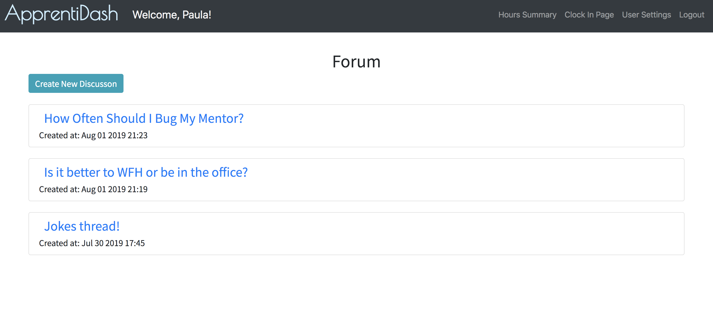
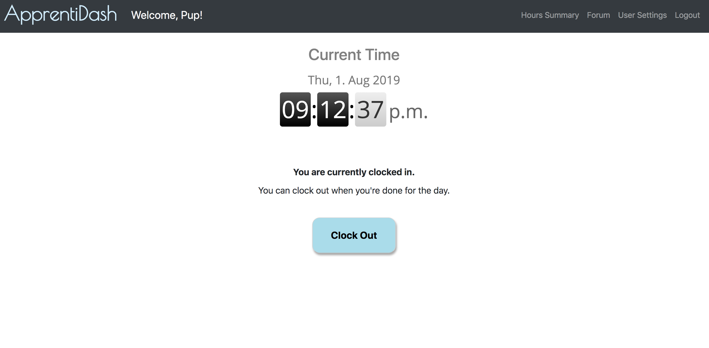
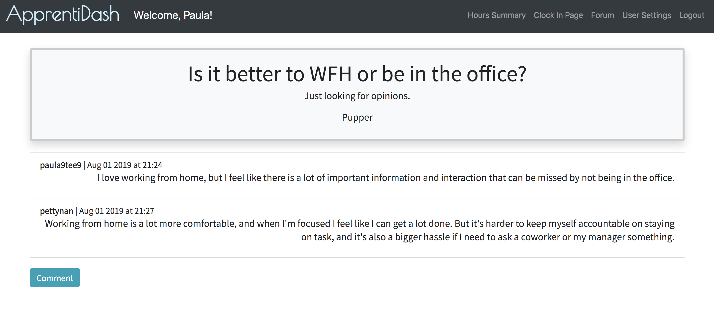

# ApprentiDash v2 - Team Queue 

ApprentiDash is a tool to clock OJT hours and a hub to connect with other Apprentices. 

If none of the above applies, you can also use ApprentiDash for any general timesheet needs. 

This project was built on top of the original [Apprentice Dashboard](https://github.com/team-boolean/apprenti-dash).

If you want to try it out for youself, you can find the live deployment [here](http://finalprojectapprentidashboard-env.4gepw3ap4a.us-west-2.elasticbeanstalk.com).

If you want to learn more about the problem this project addresses, you can find our mock press release [here](
./supplementalReadmes/PressRelease.md). 

## Features

#### Full Authentication: 
Log in and have access to all your timesheet data. 

#### Timesheet Management

Clock-in/out/and in-between. Using a single button press, users can record their working hours throughout the day.

This app also allows users to view a summary of their hours, edit dates/times, and export them to a csv file.

  

#### Notifications

Do you want to know if an account was created using your email address? Do you like to get notifications on your 
phone to confirm that you are done for the day? This app supports both cases with email and text notifications. 

#### Apprenti Forum

Get answers to questions only Apprentices would understand. Or, you know, share a Dad joke or two. 
 
The ApprentiDash forum has full functionality to create a new discussion and comment on others' discussions.

## Getting Started

The easiest way is use our app is via our [live deployment](http://finalprojectapprentidashboard-env.4gepw3ap4a.us-west-2.elasticbeanstalk.com/).

Simply create an account, and you're good to go!

If you are planning to use this app locally, see [this guide.](./supplementalReadmes/LocalDeploy.md) 

If you want help deploying to AWS, see [this guide.](./supplementalReadmes/AWSDeploy.md) 

 
## Learn More

If you would like to learn more about the architecture of this app and the technologies used, 
[visit this breakdown.](supplementalReadmes/Architecture.md) 
   
ApprentiDash V2 is brought to you by these devs: 

   - [Paula Thomas](https://github.com/Paula9t9)
   - [Yuan Gao](https://github.com/ygao0719)
   - [Peter Tynan](https://github.com/pettynan)
   - [Reina Vencer](https://github.com/river-ceanne)
   
  Click the links above to visit their GitHub profiles and learn more about 
   them. 
   
   
   

