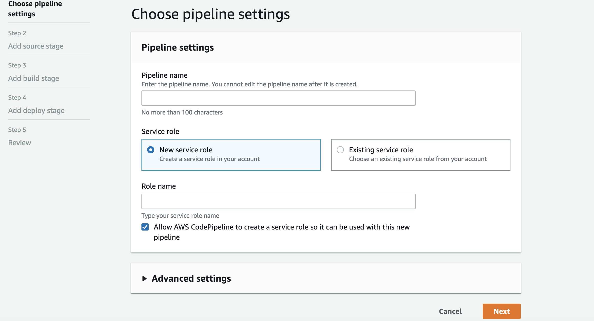
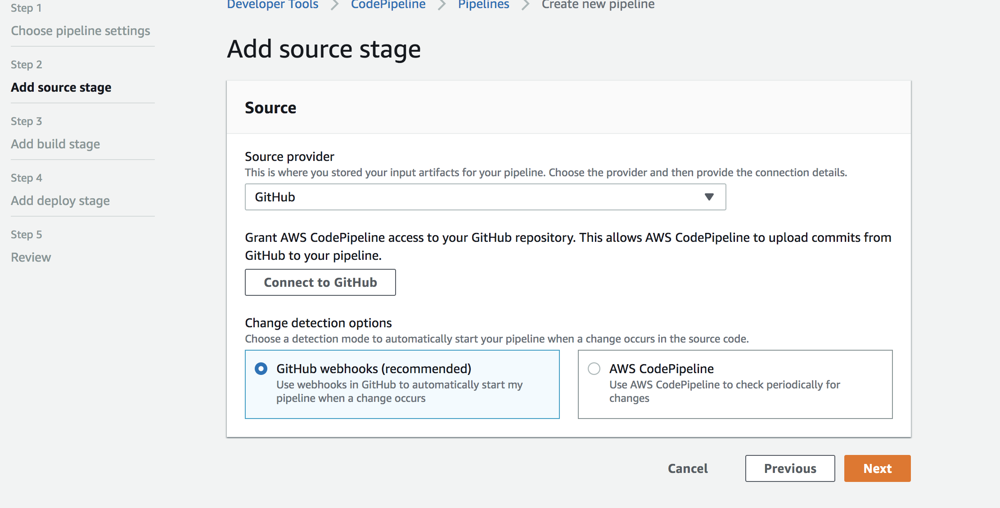
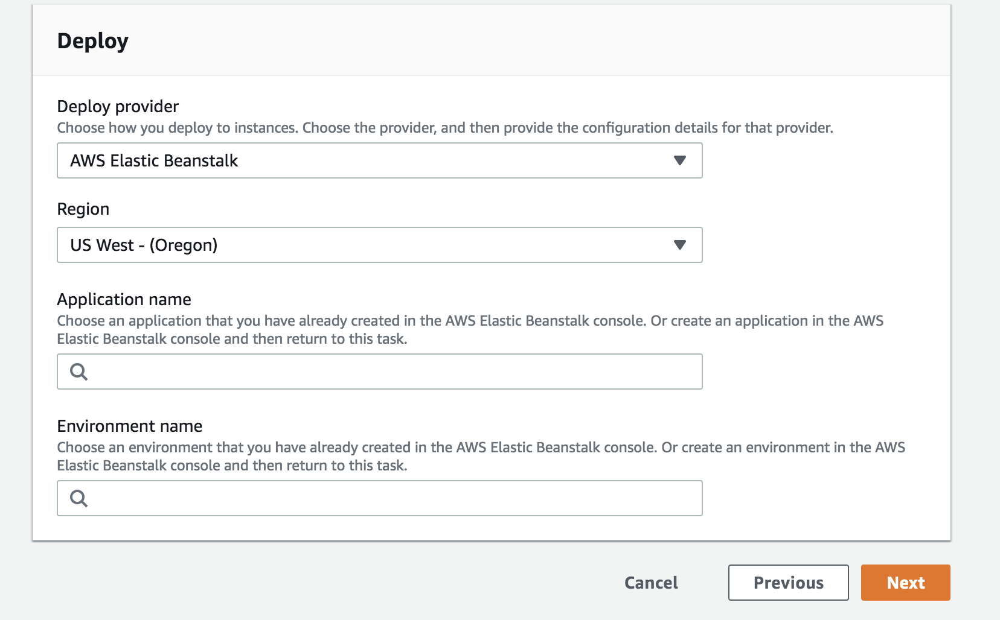
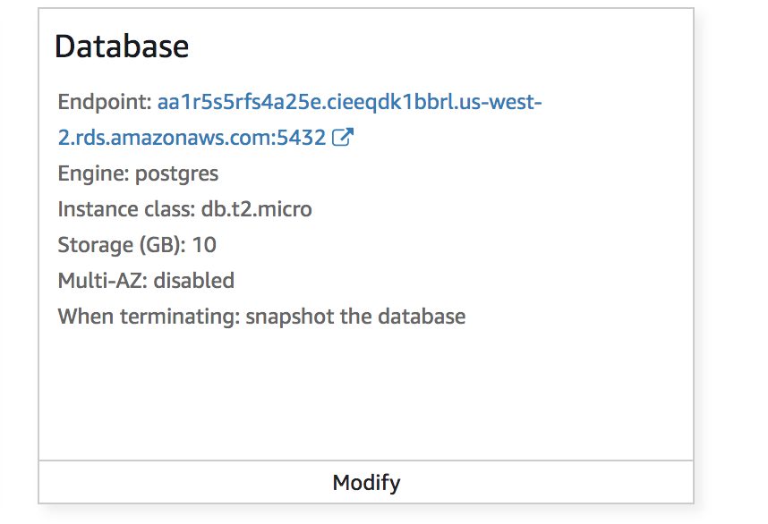
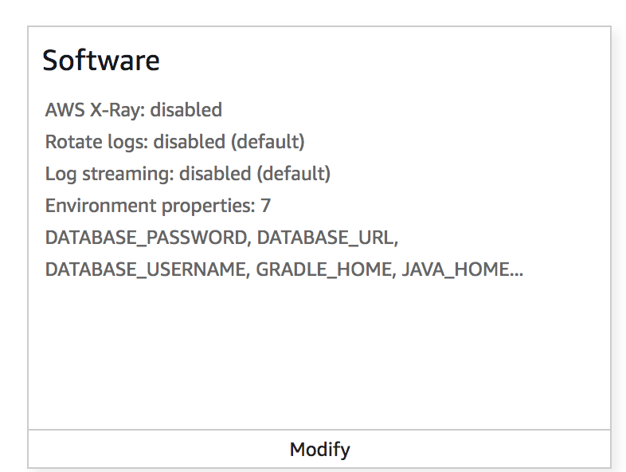
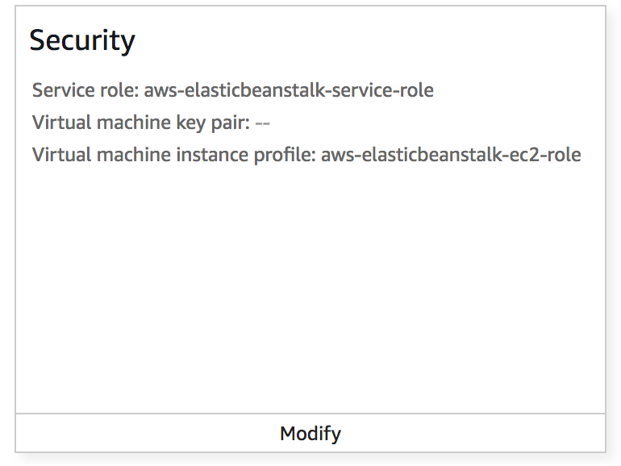

# Cloud Deploy with AWS

If you are planning to deploy to the cloud, the best way to do so is with Elastic Beanstalk and Code Pipeline.

Elastic Beanstalk allows you to easily set up your project on an AWS EC2 instance, and Code Pipeline allows you to 
continuously deploy new versions of your project directly from github.  

As for the database, this project uses Postgres SQL, so we recommend using RDS.  

## Instruction to set up Code Pipeline
1. Go to AWS console and search for CodePipeline
2. Create pipeline 
3. Choose pipeline Setting 
4. Add your git hub repository as your source stage 
5. Skip the build stage for now
6. In this Deploy page, create the application name and environment name. After you review this pipeline creation, Code pipeline
 will automatically create the Elastic Beanstalk and EC2 environment for you. 
7. Follow the next instruction to set up the Elastic Beanstalk

## Instruction to Config Elastic Beanstalk
1. Go to Elastic Beanstalk and click on the application you just created. 
2. On the left side bar, click on the configuration.
3. Click on Database 
4. Pick postgres as Engine and create your own Username, passworkd for database. 
5. Elastic Beanstalk will create RDS for you. Go to AWS RDS copy the end point after the database is complete. 
6. Go back Configuration and click on software 
7. Under environment properties, add Database_password, Database_url and Database_username.
8. Go back Configuration and click on security. Check the IAM instance profile and make sure the role has SNS and SES permissions.

9. You are done with the configuration of Elastic Beanstalk. 

## CI/CD - Deployment Process
We have partially automated our deployment process using CodePipeline to listen to changes on the master branch of our GitHub repo. However, we are still manually building the application.jar file used by EB. These are the steps we took each time we deployed our current working (Development) branch.
1. Merge all working branches into the development branch.
2. Pull development branch, test to make sure the app is working.
3. Edit application.properties, comment in/out the appropriate lines for deployed app vs. running app locally.
4. In console, run ./gradlew bootJar
5. Copy /build/libs/application.jar into the root level of the repo, replacing the old application.jar file there.
6. Merge these changes back into the GitHub development branch.
7. Merge Github development branch into GitHub master branch. Now, CodePipeline will detect the changes to master branch, pass the repo to EB, and EB will deploy the new application.jar file to an EC2 instance.
8. Finally, everybody pulls master to master on their local machines, and pulls development to development to avoid merge conflicts.

## SNS/SES Setup
We use AWS SDK of java to send Emails and messages. We can send to user's phone number once user type in the correct phone number.
But we could not sent emails to all users because AWS need verify the emails. 

Reference: https://docs.aws.amazon.com/ses/latest/DeveloperGuide/send-using-sdk-java.html
https://docs.aws.amazon.com/sns/latest/dg/sms_publish-to-phone.html

