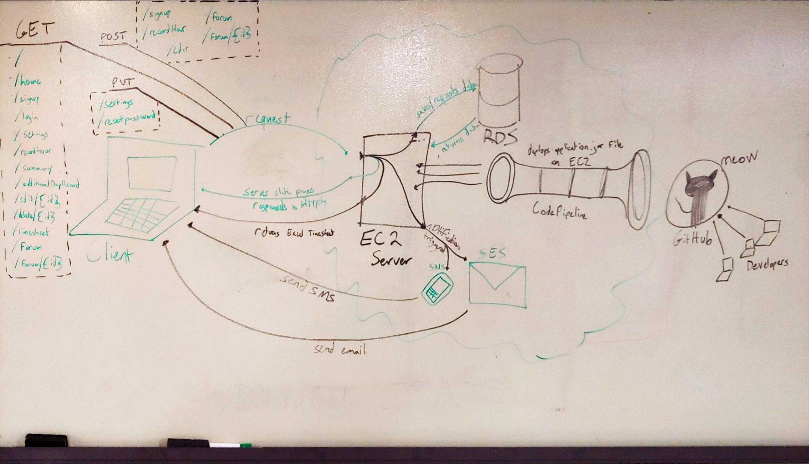

# Architecture

ApprentiDash relies on AWS technology to provide a smooth and robust experience.  

#### Technologies Used
- AWS RDS
- AWS Elastic Beanstalk
- AWS EC2
- AWS Cloudwatch
- AWS Code Pipeline
- AWS SNS
- AWS SES
- SpringBoot MVC
- Thymeleaf
- Bootstrap

## Architecture/Data-Flow

