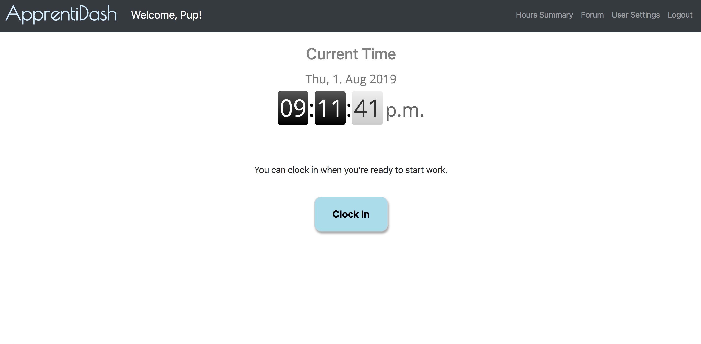
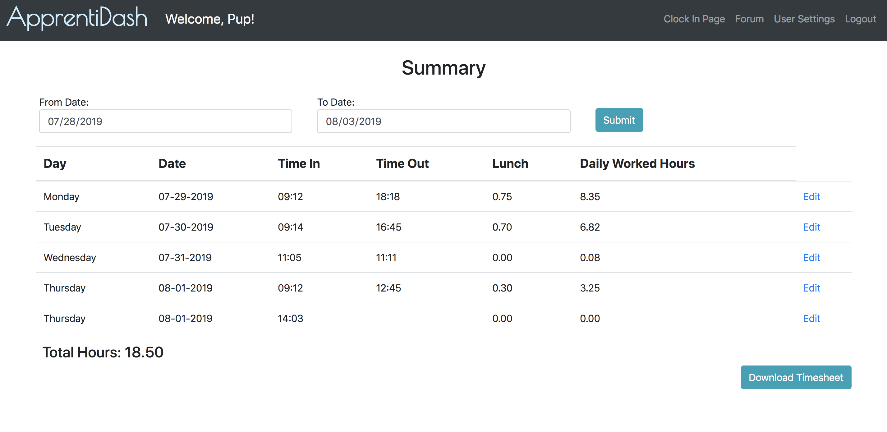
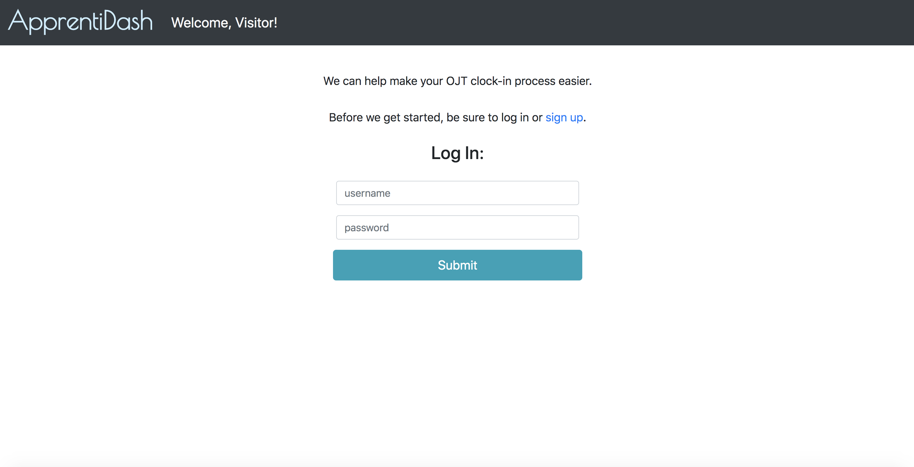

# The Apprentice Dashboard

#### A fast way for Apprentices to track their hours throughout the week. 

With a single click of a button, our users can clock-in and start their day. No need to open multiple forms or 
calculate hours. Our app will take care of the math for you. 

___
### Why Do We Need the Apprentice Dashboard?

For Apprentices in the Apprenti program, there is a lot to keep track of. New people, new responsibilities, new ways 
to code, and more. Having to fill in two separate timesheets (one for Apprenti, and one for their employer) is one more 
straw on 
the camel's back.  

### How Will the Apprentice Dashboard Lighten the Load?

Apprentices can come in on Monday, open their browser to the Apprentice Dashboard, and click 
"Clock-In". The Dashboard will do the task of recording the current time, 
and the Apprentice can get to work. Repeat the process when coming and going throughout the week, and by Friday evening 
the Apprentice will have a nice summary of all their hours and times. 

*"With the Apprentice Dashboard, you won't lose precious time managing excel sheets. You can get in and get to work 
without losing productivity on menial tasks." -Paula Thomas, Team Boolean Representative*

___
## How to Get Started With the Apprentice Dashboard

Visit the Apprentice Dashboard [website](http://apprenti.us-west-2.elasticbeanstalk.com/) and create an account to 
get started. 

And that's it! The website will automatically redirect you to the Clock In page where you can clock in and be on your
 way. 
 
 If you would like to view or edit your hours, you can visit the summary page at any time via the link at the top of 
 the page.
 
 If you would like to download your hours as a csv file, you can do so via the summary page by clicking the 
 "Download Timesheet" button. 
 
 That's three button presses to go from signing up to downloading a file.
 
 
 
 ___
 
 *"I already have too many things to worry about. I am glad that clocking in isn't one of them." -Hypothetical Customer*
 
 
 If you would like to start your own Apprentice Dashboard timesheet, visit our 
 [website](http://apprenti.us-west-2.elasticbeanstalk.com/) today.
 
 If you have any questions, feel free to visit our [FAQ page](FAQs.md). 